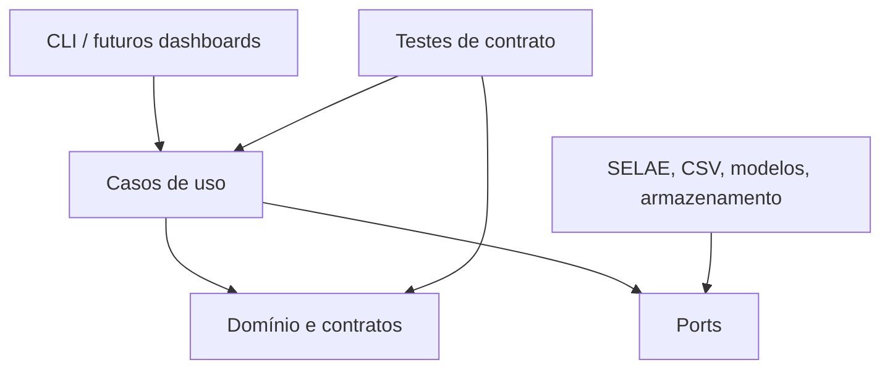

# Arquitetura

O projeto usa uma arquitetura em camadas para manter regras científicas independentes
de downloaders, modelos e interfaces.



## Limites

- O domínio não faz I/O e não depende de NumPy, pandas ou frameworks de ML.
- Casos de uso recebem dependências por contratos.
- Infraestrutura converte formatos externos para entidades validadas.
- A CLI nunca replica validações do domínio.
- Backtests e execução operacional compartilham o mesmo relógio lógico.

## Estrutura

```text
src/bonoai/
├── application/
├── domain/
├── infrastructure/
├── ports/
└── cli.py
```
